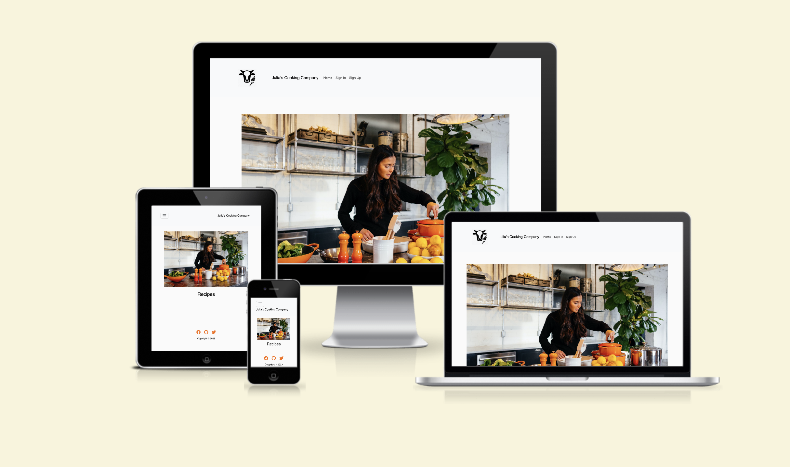
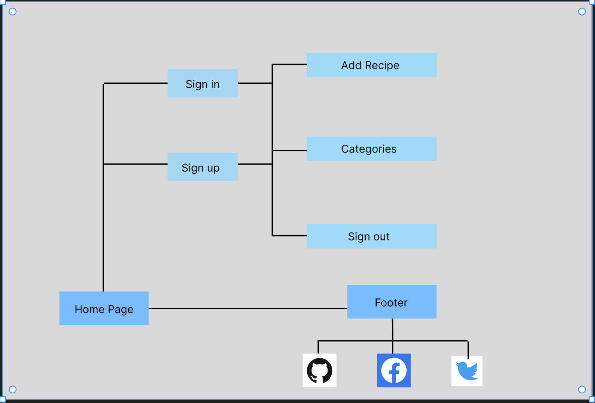
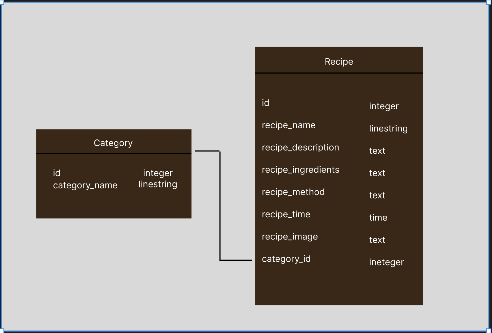
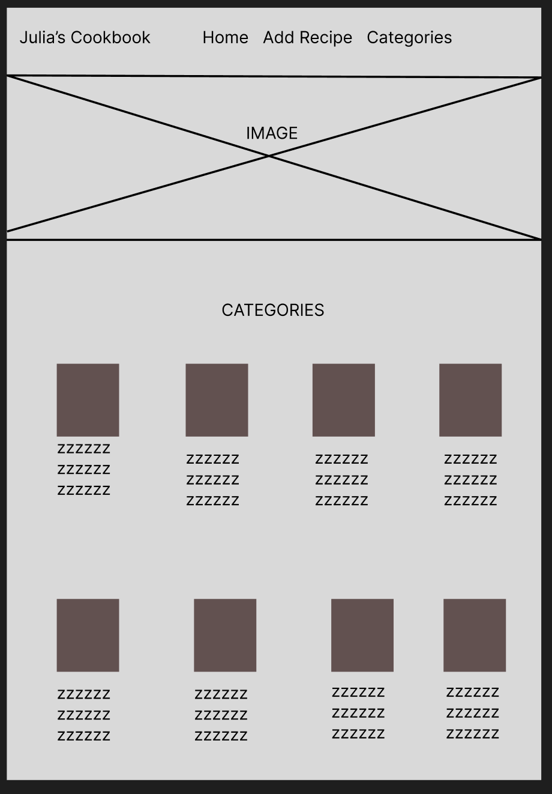
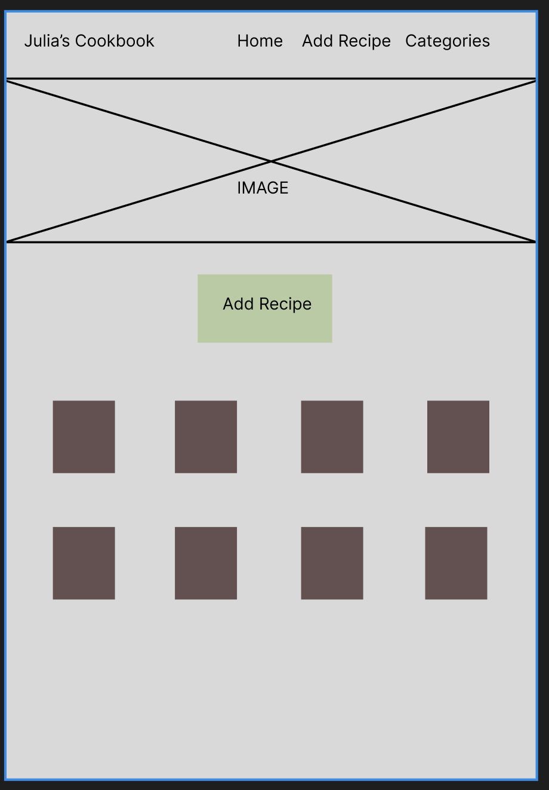

# Julia's Cooking Company

  

[Click here to view the live project]
(https://julias-recipe-book-b02aaf5bf9b3.herokuapp.com)

## Table of contents

1. Introduction
2. UX
   1. User Demographic
   2. User Stories
   3. Development Planes
   4. Design
3. Features
   1. Design Features
   2. Existing Features
   3. Features to Implement in the Future
4. Issues and Bugs
5. Technologies Used
   1. Main Languages Used
   2. Frameworks, Libraries & Programs Used
6. Testing
   1. Testing User Stories
   2. Manual Testing
   3. Automated Testing
   - Code Validation
   - Browser Validation
   4. User Testing
7. Deployment
   1. Deploying on GitHub Pages
8. Credits
   1. Content
   2. Media
   3. Code
9. Acknowledgements

---

## Introduction

The primary goals of Julia's Cooking Company website is to provide a web-based application that is intuitive and easy to navigate, and allows users to add, edit, search and delete recipes.

This is the third of four Milestone Projects that the developer must complete during their Full Stack Web Development Program at The Code Institute.

The main requirements of this project are to build a responsive, simple site using HTML, CSS, JavaScript, Python, Flask and SQL Database.

## UX

### User Demographic

The ideal user for this website is:

- New user
- Returning user
- Person interested in cooking/looking for recipes

### User-Stories

#### New User

1. As a new user, I want to be able to navigate to Sign-Up page to register an account.
2. As a new user, navigate the site intuitively.
3. As a new user, easily access recipes.

#### Returning User

1. As a returning user, I want to be able to access my account on the website.
2. As a returning user, I want the information I seek to be easily accessible, like recipe instructions.
3. As a returning user, I expect to function without errors.

#### Person with an interest in cooking

1. As a person with an interest in cooking, I want to be able to expand on my knowledge by finding relevant recipes.
2. As a person with an interest in cooking, I want to access a recipe site where I can share and edit my own recipes.
3. As a person with an interest in cooking, I want to easily navigate the entire site intuitively.

### Development-Planes

For the site to function as intended and fulfil its purpose for the user, the developer needs to develop all aspects of a functional web-based application. 

#### Strategy

Strategy incorporates user needs as well as product objectives. This website will focus on the following target audience, divided into three main categories:

- **Roles:**

  - New user
  - Returning user
  - A person with an interest in cooking

- **Demographic:**

  - people researching recipes
  - teens
  - adults

- **Psychographic:**
  - Any socioeconomic status and age group
  - Interested in cooking

The website needs to enable the **user** to:

- Add,Update and Delete Recipes :
  - Buttons on Nav bar to add catgeory and recipe
  - Buttons for Editting and Deleting records
  - Log/Sign in button (in relation to editting and deleting records)
  - Form to submit method, time and description of recipe 

The website needs to enable the **site manager** to:

- View the recipes added by different users
- Improve the site as necessary with various new features

#### Scope

The scope plane is about defining requirements based on the goals established on the strategy plane. Using the information in the strategy plane, the identified required features have been broken into the following two categories.

- Content Requirements:
  - The user will be looking for:
	 - Recipes that can be viewed on the main page
	- Visible button
	 - Intuitive navigation bar
	- Social Media links for those with further interest in cooking/looking for recipes
   	- View Categories 
	- Functionality Requirements
  - The user will be able to:
    - Log in/ Register/ Log out of the website 
    - Be able to easily navigate the site to find the information they require, like social media links etc
    - Add/edit/delete recipes to a category
    - Add /edit/delete recipes

#### Structure

The information above was organized in a hierarchical tree structure, showing how users can navigate through the interactive site with ease and efficiency, with the following results:

Structure of the Site

  

The structure of the models and database is included below :

Structure of the Database

  

### Skeleton

Wireframes were made to showcase the appearance of the site pages while keeping a positive user experience in mind. The wireframes were created using an online version of [Figma](https://www.figma.com).

    
    

### Design

#### Colour Scheme

I have chosen my colour scheme by using [SheCodes](https://palettes.shecodes.io/) colour scheme palettes.
The colours used are :
  
#fafafa - soft grey for background;
#000000 - black for text;
#c13131 - red for footer links;
#f96d00 - orange button background colors;
#f1ecc9 - pale green for button hover background colour;
#c13131 - red for delete button;
#295f4e - green  for the edit button
#f96d00 -  orange for view button;

The soft grey was used as the background colour for the website.  
The main content text is in a black shade, as this colour creates the best contrast to guarantee the high readability of the text. Following the standard procedure, the delete buttons are red; the edit buttons are green and the view buttons are orange.
Shades picked are generally soft with a few contrasting colours like red, orange and green.
The colours are there to represent versatile colours of fruit and vegetables used in recipes.

#### Typography

The typography pairing used on this site is [Montserrat]. A backup of Sans-Serif had been applied in case of an error.

#### Imagery

The selected imagery has been sourced from various sites. 
There is an image on the main page that also shows on other pages.
A user can also use any URL of any image to include this in their recipe page.
Categories have a default image included in the images folder.
Browser logo was created by the author of the website using canva.

## Features

### Design Features

Each page within the site has a responsive and consistent navigation system. Detailed features are included below.

- The **Header** is across the top of the page. It is 100% in width and includes the title of the page.
- The **Navigation Bar** is positioned on the right-hand side of the title, it includes the "Home", "Sign In" and "Sign up" buttons.
After the user verification the navigation bar changes and buttons like "Add Recipe", "Category, "Add Category" appear instead of "Sign in" and "Sign up". 
It appears on all screen sizes. If the screen size becomes too small the menu will become collapsable with a button for access.
- The **Footer** is 100% in width. The footer is located permanently at the bottom of the page on all screen sizes. The footer contains all social media links and corresponding media logos and a copywrite text at the bottom of the footer.

<dl>
    <dt><a href="recipies.html" target="_blank" alt="Julia's Cookbook Home Page">Home Page</a></dt>
    <dd>
        The <em>Home Page</em> is a scrollable page and it includes a navigation bar, all recipes that were added to the website; buttons for deleting/editing and viewing recipes; and a description of the site.
        <ul>
            <li>
            <em>Recipes</em> - This is main focus on the page.
            </li>
            <li>
            <em>Buttons</em> - This page includes Add/Delete/Edit and View buttons that allow users to utilise CRUD functionality. 
            </li>
            <li>
            <em>The Description</em> - This section contains a short description of the page and its purpose. This will give a clear overview of the website for a new user.
            </li>
	     <li>
            <em>Footer</em> - This section contains social media links to Facebook, Gitpod and Twitter.
            </li>
        </ul>
    </dd>
</dl>
<dl>
    <dt><a href="categories.html" target="_blank" alt="Categories page">Categories Page</a></dt>
    <dd>
        The <em>Categories</em> is a scrollable page that includes cards with categories. It consists of an image and category name; The cards also have a button to edit and delete categories 
        <ul>
            <li>
            <em>Title</em> - this reflect the sites purpose.
            </li>
            <li>
            <em>Main Content</em> - cards with categories
            </li>
            <li>
            <em>Footer</em> - This section contains social media links to Facebook, Gitpod and Twitter.
            </li>
        </ul>
    </dd>
</dl>

### Existing Features

- **Header** - Appears on every page; This includes the title of the page and a graphic that carries the theme of the website.
- **Navigation Bar** - Appears on every page to provide visible and easily accessible navigation.
- **Footer** - Appears on the bottom of every page. This provides easy access to external links.
- **Social Media Links** - Appears in the footer, at the bottom of every page. Links are embedded in the social media icons and open in a new tab to provide a better user experience.
- **Recipe card field** - Appears at the epicentre of the Recipies/Home page. It consists of cards with recipe information and buttons for viewing/editing/ deleting and adding recipes. 
- **Add recipe** - The "Add recipe" button is there to allow users to add recipes. After clicking it will take the user to a form for adding a recipe. The recipe will then appear on the main page and the user will be redirected there after clicking "Submit".
- **Social Media Links** - Social media links will open a new tab with a chosen site, as per the logo.

### Features To Implement In The Future

- **Favourites section**
  - **Feature** - Create a feature where users can add recipes to favourites after logging in.
  - **Reasons For The Feature Not Being Currently Included** - not a sufficient amount of time to execute this on a desired level as well as more coding practice required.
- **Recipes edit/delete features only available for users who created a given recipe**
  - **Feature** - The user will only be able to edit and delete the recipes they added themselves. Everyone will still be able to view recipes as long as they are logged in.
  - **Reasons For The Feature Not Being Currently Included** - not a sufficient amount of time to execute this on a desired level;
- **Reviewing Recipes**
  - **Feature** - Create a function where users can review recipes and add comments under them.
  - **Reasons For The Feature Not Being Currently Included** - not a sufficient amount of time to execute this on a desired level. More practice and expertise in coding is needed.
- **Videos**
  - **Feature** - Create a feature where videos can also be uploaded with recipe instructions alongside the written instructions.
  - **Reasons For The Feature Not Being Currently Included** - not a sufficient amount of time to execute this on a desired level.

## Issues and Bugs

The developer ran into several issues during the development of this site. The most interesting ones have been described below, this includes the fix for the bugs.

**Adding images to page** - A bug was detected whilst the developer was testing the site and tried to add images. The models for the database needed to be changed but the website came up with few errors. Eventually, with the help of a tutor, the developer managed to update the data models correctly. The models were updated to add image value and then the form updated to enable the user to add images. The images are now able to be generated from URLs.

**View Recipe** - The view recipe option vame up with few errors during development of the page. The error referred to the routes.py file where the page was not correctly connected and recipes could not be viewed. The recipe had to be connected correctly and routes changed to reflect GET method. The database itself also had to be updaed with new models. 

**Delete button** - Upon creating the delete button the developer realised that it did not trigger the desired behaviour. The button was supposed to warn the user before actually deleting a record but it didn't. The developer had to add a modal which then was included in the functionality of the button. Then the developer added Close and Delete button for the user, to confirm which action they would like to proceed with.

## Technologies Used

### Main Languages Used

- HTML5
- CSS3
- JavaScript
- Python
- Bootstrap
- SQL 

### Frameworks, Libraries & Programs Used

[GitHub](https://github.com/ "Link to Github") - was used to store the project after pushing from Codeanywhere.
[Codeanywhere](https://codeanywhere.com/signin"Link to Codeanywhere") - was used to write and commit the code as well as push it to GitHub.
[Font Awesome](https://fontawesome.com/ "Link to Font Awesome") - was used to obtain icons for the project.
[Figma](https://www.figma.com/ "Link to Figma") - was used to create Wireframes.
[Google Fonts](https://fonts.google.com/ "Link to Google fonts")- was used to source fonts for the project.
[Canva](https://www.canva.com/ "Link to Canva") - was used to create graphics for the project.
[Am I Responsive?](https://ui.dev/amiresponsive "Link to Am I Responsive?") - was utilised to check if the site is responsive.
[Heroku](https://heroku.com/ "Link to Heroku") - was used to deploy the website.
[Favicon](https://favicon.io/ "Link to Favicon") - was used to create a logo for the business and browser tab.

## Deployment

 This milestone project was developed using [Codeanywhere](https://codeanywhere.com/signin "Link to Codeanywhere site"), which was then committed and pushed to GitHub using the Codeanywhere terminals.

### Deploying on Heroku

Generate the requirements.txt file with the following command in the terminal. After you run this command a new file called requirements.txt should appear in your root directory
 pip freeze --local > requirements.txt
Heroku requires a Procfile containing a command to run your program. Inside the root directory of your project create the new file. It must be called Procfile with a capital P, otherwise Heroku won’t recognise it
Inside the file, add the following command web: python run.py
Ensure you do not add a blank line to the end of the file as this can cause problems for deployment.
Open your __init__.py file
Add an if statement before the line setting the SLQALCHEMY_DATABASE_URI and, in the else, set the value to reference a new variable, DATABASE_URL.
 app = Flask(__name__)
 app.config["SECRET_KEY"] = os.environ.get("SECRET_KEY")
 if os.environ.get("DEVELOPMENT") == "True": app.config["SQLALCHEMY_DATABASE_URI"] = os.environ.get("DB_URL") else app.config["SQLALCHEMY_DATABASE_URI"] = os.environ.get("DATABASE_URL")
To ensure that SQLAlchemy can also read our external database, its URL needs to start with “postgresql://”, but we should not change this in the environment variable. Instead, we’ll make an addition to our else statement from the previous step to adjust our DATABASE_URL in case it starts with postgres://:
 if os.environ.get("DEVELOPMENT") == "True": app.config["SQLALCHEMY_DATABASE_URI"] = os.environ.get("DB_URL")
else:
 uri = os.environ.get("DATABASE_URL")
if uri.startswith("postgres://"): uri = uri.replace("postgres://", "postgresql://", app.config["SQLALCHEMY_DATABASE_URI"] = uri
Save all your files and then add, commit and push your changes to GitHub
## Credits

### Content

- Text used in the project was borrowed and adapted from various cooking websites.

### Code

- Multiple websites were consulted and visited whilst developing this project to better understand the code that is being used and utilise the developer's knowledge gained so far. Pages used for reference are included below :
  - [W3Schools](https://www.w3schools.com/ "Link to W3Schools page")
  - [Stack Overflow](https://stackoverflow.com/ "Link to Stack Overflow")
- Any borrowed code is mentioned and acknowledged in the notes in the Gitpod

### Media

- Various platforms and pages were used for sourcing images included in this project, the main page used was [Google Images](https://www.google.com/imghp?hl=EN "Link to Google Images Page")

## Acknowledgements

- I would like to thank my mentor Owonikoko Oluwaseun for useful advice and guidance on this project.
- I would also like to thank the coders' community who created various documents explaining how Python and SQL work, so I could use that as a base to create my own, unique project.
- I would like to thank my family and friends for their objective feedback and support.