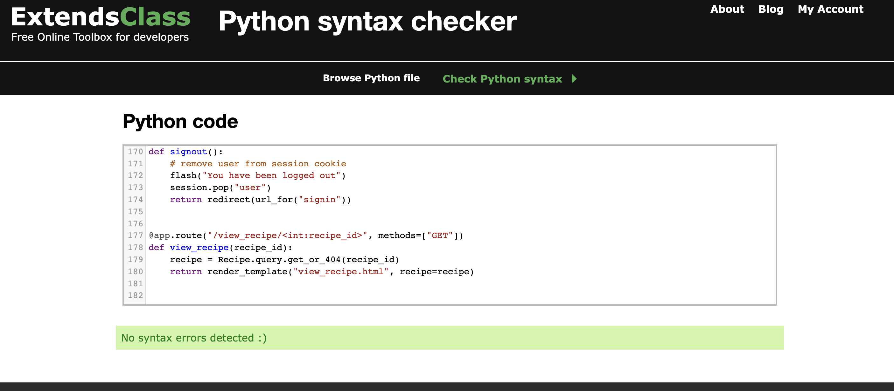

## Testing

## Testing User Stories

#### New User:

1. As a new user, I want to be able to navigate to the Sign-Up page to register an account and the Sign-In page to log in.

   - The sign-in/sign is included in the navigation bar to make the user experience better 
   - Navigation bar adapts as the user is logging/registering for easy navigation
   - Website layout is easy to navigate.
     

2. As a new user, navigate the site intuitively.

   - The navigation bar is easily accessible and visible at the top of the page.
   - The navigation bar takes the user to the correct destination and is labelled correctly.
   - The purpose of the site is easy to establish by the relevant layout and options available as well as a short description on the main page.

3. As a new user, easily access recipes.
Recipes are visible on the main page of the website.
Add Recipe button is visible and accessible through a navigation bar on the top of the page.
Edit/View/Delete Recipe buttons are visible under every recipe.
  

#### Returning User Goals:

1. As a returning player, I want to be able to access my account on the website.

   - The sign-in button is visible on top of the screen when the page loads.
   - Users can log out after accessing the logout button in the navigation bar.

2. As a returning player, I want the information I seek to be easily accessible, like recipe instructions.
   

   - Recipes are situated on the main page.
   - Website layout is easy to navigate to view recipes button.
   - The navigation bar is easily accessible and visible at the top of the page with other useful functions.

3. As a returning player, I expect to function without errors.

   - The buttons on the website are all functional and labelled correctly.
   - The navigation bar takes the user to the correct destination and is labelled correctly
     

#### Person with an interest in cooking :

1. As a person with an interest in cooking, I want to be able to expand my knowledge by finding relevant recipes.

   - The Recipes are available on the main page of the website
   - The navigation bar is easily accessible and visible at the top of the page.

2. As a person with an interest in cooking, I want to access a recipe site where I can share and edit recipes.
   

   - Buttons for editing, deleting, viewing and adding recipes are visible and work correctly.
   - Uploaded recipes can be viewed on the main page 

3. As a person with an interest in cooking, I want to easily navigate the entire site intuitively.

   - The navigation bar is easily accessible and visible at the top of the page.
   - The navigation bar takes the user to the correct destination and is labelled correctly.
   - Website layout is easy to navigate.

## Manual Testing

### Common Elements Testing

Manual testing was conducted on the following elements that appear on every page:

- Clicking on the navigation bar menu items to take the user to the correct page on the
  website

  
  

- Clicking on Sign in/ Sign up takes the user to the correct page

  
  

- Clicking on the footer items to take the user to the correct page on the
website
Facebook
Twitter
Instagram
LinkedIn

  

  
  

### Home Page

Manual testing was conducted on the following elements of the [Home Page](recipies.html):

- The responsiveness of the page

  
  
  

- Buttons for CRUD functionality visible on the main page under every recipe (view, edit, delete)

 

  

- Add Recipe Button visible on the main page

 

  

- Recipe Description, time it takes to prepare and category are visible under every recipe

  

- Buttons change background colours when hovered over

  

- The delete Recipe button comes up with a modal to give the user a choice to Cancel or Delete the Recipe permanently

  

### Category Page

Manual testing was conducted on the following elements of the [Category Page](categories.html):

- The responsiveness of the page

  

- The add category button is working and taking the user to the correct page

  

- Delete category button is working and taking the user to a modal with Close or Delete options

  

### Add a Recipe Page

Manual testing was conducted on the following elements of the [Add a Recipe Page](add_recipe.html):

- The responsiveness of the page

  

- Form is available to fill

  

- If the recipe name submitted is the one that already exists then the page will reload and an alert come up

  

- Submit Button takes the User back to the main page and uploads the recipe to the database, visible on the main page.

  

## Automated Testing

Both manual and automated testing are used to check if the project's code is written in a way the project works correctly.
Automated testing can be performed via a Python testing framework like Pytest. I am aware of the advantages the automated testing carries like high reliability, as it is run and performed by a programme as the code is developed and it is a lot quicker as hundreds of tests can be performed against the project in a short time frame.
Although more time-consuming, I have decided to utilise the manual way of testing as the project is quite small and I didn’t have the time capacity in the project window to get automated testing set up correctly.
Manual testing checks if the project works by user stories by testing it in different browsers and resolutions. The testing can be performed manually by a potential user, code creator or another third party.

In a real-life scenario, I fully acknowledge I would use PyTest to further practice my skills with automated testing and make sure that errors are picked up early and corrected promptly.

### Code Validation

The [W3C Markup Validator](https://validator.w3.org/) service was used to validate the `HTML` and `CSS` code used.
The [Extends Class](https://extendsclass.com/) service was used to validate Python.

**Results:**

- HTML Pages

  

- CSS

  

- Python

  

### Browser Validation

- Chrome

  

- Firefox

  

- Safari

  

## User testing

A few friends and family members were asked to review the page for user experience and to point out any bugs/issues. The input of this group led to small UX adjustments to improve the overall site appearance and user experience. Some of them included: Adding a Close button to the Delete modal, Adding color changes to buttons and graphics adjustments.